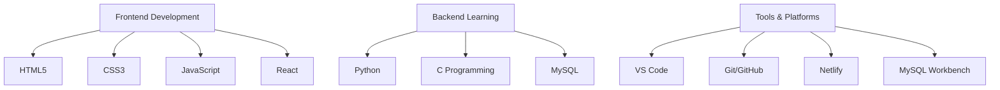
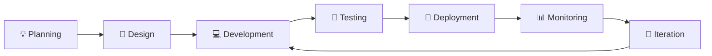
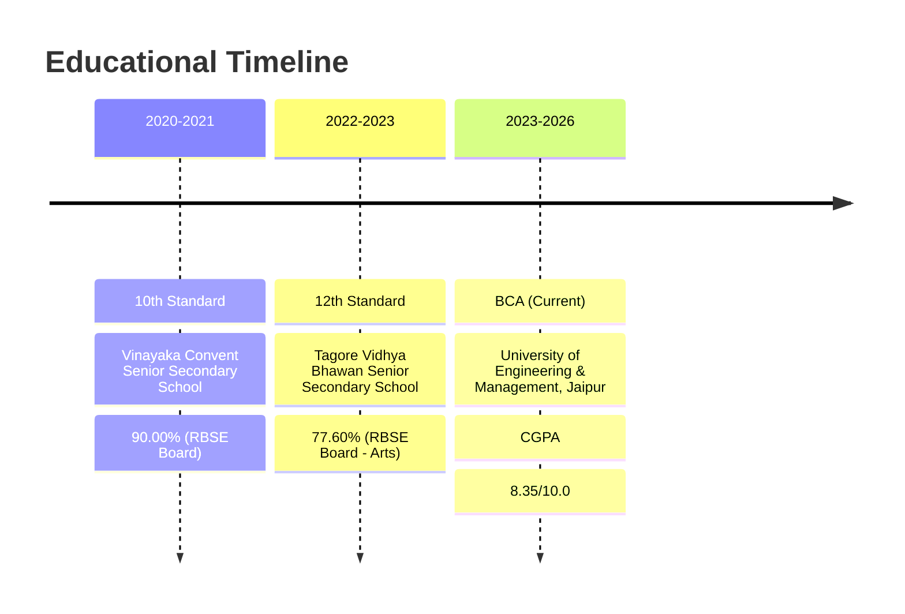
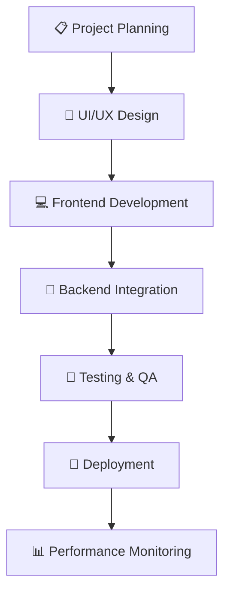
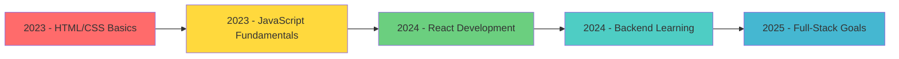
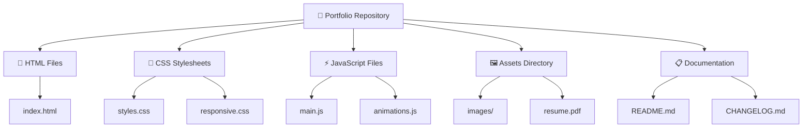

# 💼 Preetam Kumawat - Frontend Developer Portfolio

## 🎯 Overview

Professional portfolio showcasing frontend development expertise, with a focus on responsive web applications and modern user interfaces. Currently pursuing Bachelor of Computer Applications while building practical experience through self-directed projects and hackathon participation.

**🌐 Live Portfolio:** [preetamkumawat-portfolio.netlify.app](https://preetamkumawat-portfolio.netlify.app)

## 📋 Professional Summary

Frontend Developer with demonstrated expertise in HTML5, CSS3, JavaScript, and React. Specializes in creating responsive, user-centric web applications with emphasis on clean code architecture and optimal performance. Currently expanding skillset toward full-stack development capabilities.

**🎓 Current Status:** BCA Student (2023-2026) | University of Engineering & Management, Jaipur  
**📊 Academic Performance:** CGPA 8.35/10.0

## 🛠️ Technology Stack



### 🎨 Frontend Development
- **Languages:** HTML5, CSS3, JavaScript
- **Frameworks:** React
- **Specializations:** Responsive Design, UI/UX Implementation, Performance Optimization

### 🔧 Additional Technologies
- **Programming Languages:** Python, C
- **Database Management:** MySQL
- **Development Tools:** VS Code, Git, GitHub
- **Deployment Platforms:** Netlify

## 🚀 Featured Projects

### 🏢 Bunaai Homepage Clone
**🔧 Technology Stack:** HTML5, CSS3  
**📝 Description:** High-fidelity homepage reproduction demonstrating semantic markup and modern CSS techniques.  
**🌐 Live Demo:** [bunaai-clone.netlify.app](https://bunaai-clone.netlify.app)

### 🌱 Plantation Web
**🔧 Technology Stack:** HTML5, CSS3, JavaScript  
**📝 Description:** Responsive web application with modern layout architecture for plantation industry client.  
**🌐 Live Demo:** [plantation-web.netlify.app](https://plantation-web.netlify.app)

### 🛒 E-Commerce Application - The Naari House
**🔧 Technology Stack:** HTML5, CSS3, JavaScript  
**📝 Description:** Innovative e-commerce platform featuring digital mirror interface, developed for ACEHACK 4.0 competition.  
**🌐 Live Demo:** [thenaarihouse.netlify.app](https://thenaarihouse.netlify.app)

## 📈 Development Workflow



## 💼 Professional Services

### 🚀 Performance Optimization
Website speed enhancement, SEO implementation, and user experience optimization.

### 🐛 Code Maintenance & Debugging
Code quality assurance, error resolution, and legacy code modernization.

### 📱 Responsive Web Development
Cross-platform compatibility ensuring consistent functionality across mobile, tablet, and desktop environments.

## 🏆 Recognition & Achievements

**🥈 Silver Medal - Techutopia 2024**  
Awarded at webathon competition organized by University of Engineering & Management, Jaipur in collaboration with Google Developer Groups.

**🎯 ACEHACK 4.0 Participant**  
Selected participant in major hackathon competition, contributing to innovative e-commerce solution development.

## 📚 Educational Journey



### 🎓 Bachelor of Computer Applications (BCA)
**🏛️ University of Engineering & Management, Jaipur, Rajasthan**  
**📅 Duration:** 2023 - 2026 | **📊 CGPA:** 8.35/10.0

### 📖 Higher Secondary Certificate (Arts Stream)
**🏫 Tagore Vidhya Bhawan Senior Secondary School, Sikar**  
**📅 Year:** 2023 | **📊 Percentage:** 77.60% | **📋 Board:** RBSE

### 🏫 Secondary School Certificate
**🏛️ Vinayaka Convent Senior Secondary School, Sikar**  
**📅 Year:** 2021 | **📊 Percentage:** 90.00% | **📋 Board:** RBSE

## 💼 Professional Experience

### 👨‍💻 Frontend Developer (Self-Employed)
**📅 Duration:** 2023 - Present



**🎯 Key Responsibilities:**
- Developed 3+ production-ready web applications including portfolio websites, e-commerce platforms, and booking systems
- Implemented responsive design principles ensuring cross-device compatibility
- Applied modern web development practices including semantic HTML, CSS Grid/Flexbox, and ES6+ JavaScript
- Focused on performance optimization and user experience enhancement
- Managed complete project lifecycle from conception to deployment

**🏆 Key Accomplishments:**
- ✅ Successfully deployed multiple web applications using modern deployment platforms
- ✅ Demonstrated proficiency in problem-solving through real-world project implementation
- ✅ Gained expertise in end-to-end web development workflows

## 📈 Skills Progression



## 🌐 Professional Contact

**💼 Portfolio Website:** [preetamkumawat-portfolio.netlify.app](https://preetamkumawat-portfolio.netlify.app)  
**📄 Resume:** [Download Professional Resume](https://preetamkumawat-portfolio.netlify.app/assets/PreetamKumawat-Resume.pdf)  
**📧 Contact:** Available through portfolio website contact form

## 🎯 Career Objectives

- 🔧 Advance technical expertise in full-stack development methodologies
- 🌟 Contribute to open-source development initiatives  
- 🚀 Pursue opportunities in professional web development teams
- ☁️ Develop expertise in modern backend technologies and cloud deployment

## 📊 GitHub Stats

```mermaid
gitgraph
    commit id: "Portfolio Launch"
    commit id: "Bunaai Clone"
    commit id: "Plantation Web"
    branch hackathon
    commit id: "ACEHACK 4.0"
    commit id: "Silver Medal"
    checkout main
    merge hackathon
    commit id: "Resume Update"
    commit id: "Skills Enhancement"
```

## 🔧 Repository Architecture



---

**⭐ Repository Information**

This repository contains the source code and documentation for my professional portfolio website. The portfolio demonstrates current technical capabilities, project implementations, and professional development progress.

**📅 Last Updated:** August 2025  
**📊 Status:** Active Development  
**🔄 Version:** 2.1.0